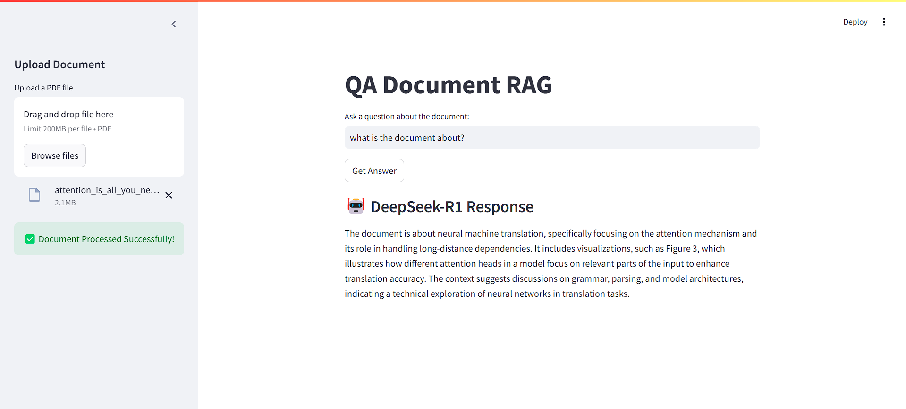

# QA Document RAG



## Overview
This project is a **Retrieval-Augmented Generation (RAG) Question-Answering System** built with **Streamlit**, **LangChain**, and **Groq's DeepSeek-R1** model. It allows users to upload a **PDF document**, process it into a **Chroma vector database**, and ask questions about the document using a powerful **LLM-based retrieval system**.

## Features
- **PDF Upload**: Users can upload a PDF document through the Streamlit UI.
- **Chroma Vector Store**: The document is processed into vector embeddings and stored for efficient retrieval.
- **LLM-Powered QA**: Users can ask questions related to the uploaded document, and answers are generated using **DeepSeek-R1**.
- **Text Processing**: The model removes unnecessary tokens (`<think>` tags) to provide clean answers.

## Installation

### 1. Clone the Repository
```bash
git clone https://github.com/aniket-1177/DocQA-RAG.git
cd <repository-folder>
```

### 2. Create a Virtual Environment
```bash
python -m venv venv
venv\Scripts\activate    # On Windows
```

### 3. Install Dependencies
```bash
pip install -r requirements.txt
```

### 4. Set Up Environment Variables
Create a `.env` file in the root directory and add the following:
```ini
GROQ_API_KEY=your_groq_api_key
```

## Usage
### 1. Run the Streamlit App
```bash
streamlit run main.py
```

### 2. Upload a PDF
- Navigate to the **sidebar** and upload a **PDF file**.
- The document will be **processed and stored** in a vector database.

### 3. Ask a Question
- Enter your **question** in the text input field.
- Click **Get Answer** to retrieve an answer from the document using the **DeepSeek-R1 model**.

## Dependencies
- **Streamlit**: For building the interactive web interface.
- **LangChain**: For handling document processing and retrieval.
- **Chroma**: As a vector database for storing document embeddings.
- **DeepSeek-R1 (Groq API)**: A high-performance LLM for answering questions.
- **HuggingFace Embeddings**: For generating document embeddings.

## Future Improvements
- Add support for **multiple documents**.
- Implement **UI enhancements** for better user experience.
- Support **other LLM models** for comparison.